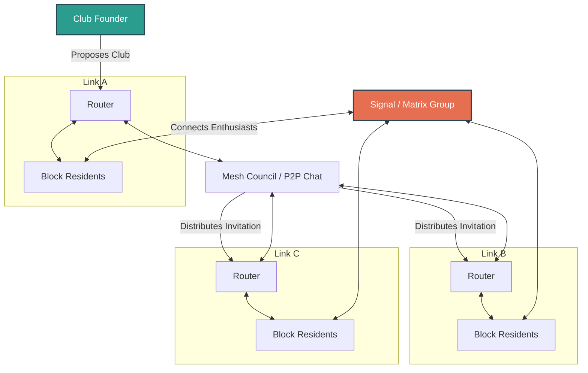

# MNeighbor Alliance (MNA) — Community Clubs Playbook
## Connecting Neighbors Across Blocks Through Affinity Meshes

While **The Neighbor Link** is designed to help individual blocks organize events and manage legal liability, building deep community connection often requires connecting people with shared interests. 

A single block might only have one person interested in amateur radio, beekeeping, or community gardening. By networking multiple block Links together, we can form thriving **Community Clubs** without creating centralized administrative overhead.

---

## ⚖️ The Model: Autonomous Affinity Meshes

To preserve the autonomy of local block Links and protect the alliance from operational liability, Community Clubs operate under a specific **Affinity Mesh** model:

1.  **Fiduciary Firebreak**: MNeighbor Alliance does not govern, fund, or assume liability for Community Clubs. Club meetups, projects, and communications are autonomous and run by the participants.
2.  **Zero Custom Software**: We do not build or host a proprietary social network. Instead, we use existing, secure, and privacy-preserving tools.
3.  **Active Routing**: Club founders leverage the existing MNA communication pathways (the **Router** volunteers of each block Link) to find members across adjacent blocks.

---

## 🛠️ Leveraging Existing Infrastructure & Systems

Rather than reinventing the wheel, MNA clubs are designed to leverage existing public spaces, systems, and platforms:

### 1. Digital Communication Channels
Avoid complex forums. Choose the tool that matches your club's operational style:
*   **Signal Groups (Recommended)**: Best for general, hyper-local chat, organizing meetups, and quick coordination. Private, secure, and everyone already has it or can install it in 30 seconds.
*   **Discord / Matrix**: Best for technically oriented groups (e.g., coding, radio meshnets) requiring multiple sub-channels or forum threads.
*   **Physical Bulletin Boards**: Never underestimate the power of local library boards, cooperative grocery boards, or community center kiosks.

### 2. Meeting Spaces
Keep costs at absolute zero by using public or shared spaces:
*   **Public Libraries**: Most city library branches (such as the Saint Paul Public Library system) offer free room reservations for community groups and non-profits.
*   **City Parks**: Perfect for casual meetups, outdoor hobbies, or kids' clubs.
*   **Host Porches & Yards**: Rotate meetings between members' porches to keep gatherings highly visible and neighborhood-centric.
*   **Existing Maker Spaces / Tool Libraries**: Partner with local community workshops for tools, safety equipment, or training spaces.

---

## 📋 Active Club Frameworks
When a resident wants to spin up a new club, they can design a dedicated implementation plan detailing technical configurations, community rollout steps, and hardware guides. Currently, the alliance has initialized the following framework:
*   [LoRa Radio & Meshnet Club Plan](file:///c:/Users/donno/source/mneighbor-alliance/LORA_RADIO_CLUB_PLAN.md): A step-by-step blueprint for building a decentralized, off-grid communication network across neighborhood block links.

---

## 🛡️ Legal Boundary & Safety Guardrail

> [!WARNING]
> **Important Operating Limits & Non-Endorsement**:
> *   **No Commercial Activity**: Community Clubs must remain completely free to join and participate. No dues may be charged, and no commercial transactions may occur under the MNA name.
> *   **The Event Firewall**: While MNA's master liability insurance covers formal street-closure events run by an onboarded Link (potlucks, block parties), it **does not** cover private, off-street club meetings (e.g., a workshop in a resident's private garage). Club organizers are responsible for ensuring meeting spaces are safe and participants understand the informal nature of the club.
> *   **No Endorsement, Support, or Agency**: MNeighbor Alliance does not sponsor, endorse, audit, or approve any community clubs, interest groups, or their activities. Individual club organizers and participants do not act as agents, employees, or representatives of the Alliance, and have no authority to bind the Alliance.
> *   **Strict Compliance with Laws**: All club organizers and participants are solely responsible for ensuring that all activities comply with municipal, state, federal, and international laws, regulations, and licensing requirements. MNeighbor Alliance does not encourage, support, or condone any regulatory violations or illegal acts.
