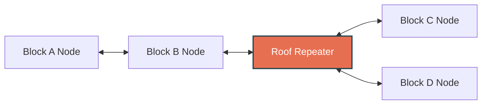

# LoRa Radio & Meshnet Club: Neighborhood Deployment Plan
## A Blueprint for Hyper-Local, Off-Grid Communications

This document serves as the complete implementation plan for setting up a decentralized, off-grid neighborhood communication network using low-power LoRa (Long Range) radios and the open-source **Meshtastic** protocol, operating within the MNeighbor Alliance (MNA) framework.

---

## 🎯 Project Goal
To establish a resilient, neighbor-owned communications mesh across multiple adjacent block Links. This mesh functions entirely without cellular service or internet, providing off-grid text messaging, location mapping, and emergency communications.

```
[Phone (App)] --(Bluetooth)--> [Meshtastic Node] --(915MHz LoRa Mesh)--> [Neighborhood Nodes]
```

---

## 🛠️ Phase 1: Digital & Hardware Foundation

### 1. Digital Basecamp Integration
*   **Existing Channels**: Connect to the established neighborhood **Signal Group** and community **Discord Server** for hardware discussions, range testing, and firmware support.
*   **Invite Link**: Obtain invite links or QR codes from active members and include them on the interest flyer.

### 2. Recommended Hardware Profiles
We utilize off-the-shelf, license-free 915 MHz ISM band hardware. Organizers should recommend these three node tiers to participating neighbors:

| Tier | Device Model | Power Source | Primary Use Case |
| :--- | :--- | :--- | :--- |
| **1. The Pocket Node** | **LilyGO T-Echo**, **Heltec V3**, or **Heltec V4** (with case) | Internal battery (USB-C rechargeable) | Daily carry, messaging from phone via Bluetooth, walking around the neighborhood. |
| **2. The Home Node** | **Heltec V3**, **Heltec V4**, or **LilyGO T-Beam** | Plugged into wall outlet near window | Constant coverage for a single household. |
| **3. The Roof Repeater** | **LilyGO T-Beam** or **RAK Wireless WisBlock** | Weatherproof box + solar panel | High-elevation node mounted to a chimney or roof mast. Essential for bridging signal gaps across multiple blocks. |

---

## 📡 Phase 2: Hyper-Local Recruiting & The Router Loop

Because LoRa nodes require line-of-sight or close proximity to relay messages, a mesh network cannot succeed on a single block. It requires a chain of nodes across multiple blocks.



1.  **Customize the Invitation**: Customize the [Club Interest Flyer Template](file:///c:/Users/donno/source/mneighbor-alliance/templates/CLUB_INTEREST_FLYER.md). Insert details about the Signal group and the upcoming meeting.
2.  **Activate the Local Router**: Share the flyer with the **Router** steward of your home Link. The Router will broadcast it to the local block chat/newsletter.
3.  **Engage the Mesh Council**: Ask your Router to forward the flyer to the Routers of adjacent Links (Links B, C, D, etc.) via the MNA Mesh Council. These Routers will print and drop the flyer onto neighborhood porches to find other radio enthusiasts.

---

## ⚙️ Phase 3: Channel Configuration & Network Setup

To communicate, all nodes in the neighborhood must share the same encryption key and channel settings.

### 1. Channel Configuration Parameters
*   **Region**: Set to `US` (915 MHz).
*   **Primary Channel (`MediumFast`)**: Standard configuration. Used for public neighborhood broadcasts, relaying node lists, and broad mesh discovery.
*   **Secondary Channel (`MNA-Mesh`)**: Create a custom encrypted channel for MNeighbor Alliance communication. 
    *   **Modem Preset**: `Medium-Fast` (provides a balanced compromise of signal speed and outdoor range).
    *   **PSK (Pre-Shared Key)**: Generate a unique 256-bit encryption key and share it via a QR code in the secure Signal/Discord channels.

### 2. Height is Might (The Repeater Rollout)
To bridge signal blocks caused by dense foliage or brick buildings:
*   Identify at least 1 or 2 neighbors with high-roof access or homes located on geographic high points.
*   Deploy a solar-powered, weatherproof IP67 enclosure containing a **RAK Wireless WisBlock** node (highly power-efficient) and a 3dBi fiberglass antenna. This acts as the community's central "backbone" repeater.

---

## 🎪 Phase 4: Neighborhood Radio Field Day (MNA Street Event)

Once 10+ neighbors have joined the Signal group or acquired nodes, host a **Radio Field Day** to test the system in the field.

1.  **Permit & Insurance**: Organize the event through an onboarded MNA Link. The Link's **Protocol** volunteer handles the SPPD street-closure application and pulls the MNA General Liability Certificate.
2.  **Setup the Street Zone**: Set up tables, pop-up canopies, and a basic soldering station for assembly.
3.  **The Range Test**:
    *   Assign volunteers to walk or bike to the outer boundaries of the adjacent block Links.
    *   Send test messages back to the closed-off street hub to map the mesh's signal strength and identify dead zones.
    *   Log node hops using the Meshtastic map interface to see exactly how the signal is routing through neighbors' homes.
4.  **Hardware Clinic**: Help neighbors flash their device firmware, connect to their phone's Bluetooth, and mount antennas.

---

## 🛡️ Operating Rules & Security Guardrails

*   **FCC Compliance**: We operate strictly within the license-free 915 MHz ISM band. No ham radio license is required, but devices must use FCC-certified low-power transmitters (typically 1 watt or less).
*   **No Commercial Traffic**: The mesh network is public infrastructure. Commercial transactions, advertisements, or paid services are prohibited.
*   **MNA Fiduciary Boundary**: Node hardware purchased by individual residents remains their personal property. MNA's master liability insurance covers only organized public gatherings (like the Radio Field Day) held within permitted Link street closures. It does not assume liability for physical rooftop node installations or device failures.
*   **Non-Endorsement & Legal Compliance**: This plan is a resident-created template. MNeighbor Alliance does not sponsor, endorse, support, or assume liability for the establishment, hardware installation, or operations of any local radio club or meshnet. Organizers and participants are solely responsible for ensuring complete compliance with FCC regulations, local ordinances, private property restrictions, and all other applicable laws. MNeighbor Alliance does not support or condone any unlawful operations, unauthorized trespassing for antenna placement, or uncertified hardware deployments.
